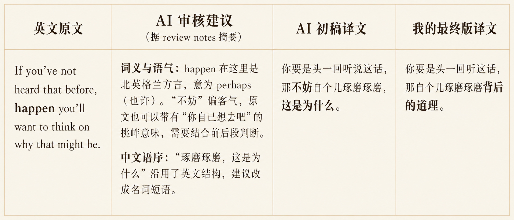

# Translation Workbench

English | [简体中文](README.zh.md)

An Agent Skill for project-scale translation. The AI drafts, reviews, and keeps the records; the workflow distills your translation style; and above all, it lets you produce solid translations even when your command of the source language is not that strong.



The table is in Chinese, the target language of the project. Its columns, left to right: the source line, what the independent review flagged (summarized from its notes), the AI's draft, and the wording I finalized. From [Chapter 04, The Fate of Grungni's Whisper](https://alexu0317-father.github.io/franz-lohners-chronicle-zh/franz-lohners-chronicle/chapters/04-the-fate-of-grungnis-whisper/output/index.html).

Current version: `0.1.1`

## Features

- The AI carries the work of understanding the source language. A translation is only as good as the translator's command of both languages, so the skill requires the AI to supply not just a rendering but the reasoning behind it. That reasoning is what closes the gap in your own grasp of the source.
- The AI learns your translation style, keeps refining it, and holds it consistent across a long project.
- This skill grew out of [a translation project of my own](https://alexu0317-father.github.io/franz-lohners-chronicle-zh/): two weeks and 54 iterations, with the workflow proven in practice before it was frozen into a skill.

## An example

[Chapter 01, The Old Baron of Bluchendorf](https://alexu0317-father.github.io/franz-lohners-chronicle-zh/franz-lohners-chronicle/chapters/01-old-baron/output/index.html) was translated by hand, and independent review caught a misreading:

> **Source**　if there was an hour's worth of light in the sky before the storms closed in, you were doing well.
>
> **My first draft**　如果在暴风雪来临前天空还有一小时的光亮就好了。 (back-translates to: if only there had been an hour of light in the sky before the storms came)
>
> **What the review flagged**　`you were doing well` lands on grim relief, that an hour of light counted as good luck, and not on the unfulfilled regret the draft expressed. The meaning is reversed. The evidence is grammatical: this is a real conditional in the past tense, describing what did happen from time to time that winter. An "if only" reading would need the subjunctive, `if there had been…, it would have been…`. The sentence just before it has a priest freezing to death at his pulpit, which also fits relief better than regret.

Google Translate and DeepL will not give you that. Every word in the line was one I knew; what defeated me was what they meant together in context. (The English line quoted here is the copyright of Fatshark.)

## Installation

Recommended install from GitHub. This installs into the current project, which is the default scope:

```bash
npx skills add Alexu0317-FATHER/translation-workbench
```

Add `-g` to install it for your user account instead, so that it is available in every project. Add `-a` to choose which agents it is installed to:

```bash
npx skills add Alexu0317-FATHER/translation-workbench -a codex -a claude-code
```

A project install puts the skill under `.agents/skills/translation-workbench/`, with each agent's own directory pointing at it, `.claude/skills/` in the case of Claude Code; `-g` does the same under your home directory. Manual installation also works: copy this repository's `skills/translation-workbench/` to `.agents/skills/` for Codex or `.claude/skills/` for Claude Code, prefixed with `~/` for a user-level install. To update an existing installation, where `-p` updates the project scope only and `-g` the global one:

```bash
npx skills update translation-workbench
```

Invocation examples:

```text
Use translation-workbench to set up a translation project from these files.
```

In Codex, name the skill directly:

```text
$translation-workbench Start source preparation for the section named "The Crossing".
```

In Claude Code, use the slash command:

```text
/translation-workbench Continue the independent review of chapter 4.
```

## Workflow

| Stage | What you do | What the AI does |
|---|---|---|
| Initialization | Tell the AI whether this is a new project, an intake of existing material, or a continuation of a named translation unit | Read the existing project README if there is one, or create it, and confirm the existing directory layout with you |
| Source preparation | Hand over whatever material you have | Verify the source is complete and check its provenance, search each candidate term against the existing glossary, list the unit's new terms, and set up the reference documents |
| Translation | 1. Ask for the translation; 2. Review the new terms the AI proposes; 3. Wait for the output | Confirm the glossary, character profiles, and related material with you, then produce the draft and the drafting notes |
| Independent review | Ask for the review and wait for the output | Review the draft against the source, glossary, character profiles, and style document, and write `review-notes.md` |
| **Finalization** | 1. Read the translation; 2. Respond to each item in the review notes; 3. Tell the AI your reasoning; 4. Decide which conclusions are worth writing into the project's documents | 1. Record your decisions in the review notes; 2. Confirm the finalized translation and any approved updates to the glossary, character profiles, and style document; 3. Propose what is worth keeping and leave the call to you; 4. Produce the finished Markdown |

Every stage checks its prerequisites before it starts. If material is missing, terms are still undecided, or existing review notes would be overwritten, the workflow stops and tells you what it needs.

## Getting more out of it

1. If you can, hand over a few sample chapters of your own translation. They help the AI understand your style before it drafts anything.
2. During **translation**, when you review the terms and character profiles the AI proposes, think about which ones deserve to stay consistent across the whole project. Anything that only holds for a single chapter should stay out of the glossary and the character profiles. The further a project goes, the more a lean set of reference files pays off.
3. During **finalization**, do not just give the AI your decision, tell it why you think so. **Your reasoning is what the AI relies on most when distilling your style.**
4. Use a separate session for each stage to keep each stage's context clean. **Independent review** is currently the only stage that usually needs no human involvement, so it can run in a subagent.

## What your project looks like after one chapter

```text
your-translation-project/
├─ README.md                  # Entry point: languages, translation units, file roles
├─ <a translation unit>/
│  ├─ source.md                 # Working copy of the source (filename is project-defined)
│  ├─ sourcing-handoff.json     # Source-preparation-to-translation handoff
│  ├─ <translated-title>.md     # Finalized translation
│  ├─ drafting-notes.md         # Drafting notes
│  └─ review-notes.md           # Review notes
├─ glossary.md                 # Glossary
├─ character-profiles.md       # Character profiles
├─ translator-style.md         # Translator style
├─ background-notes.md         # Background notes
└─ sources.md                  # Source inventory
```

Empty files are never pre-created. Each of these appears only once there is real content for it.

## Tested scope and limits

- Verified on one language pair (English to Chinese) and one kind of text (serialized fiction). Trying it on other subjects, languages, and genres is welcome; please open an [Issue](https://github.com/Alexu0317-FATHER/translation-workbench/issues) with what you find.
- The models used for translation were Opus 5 and GPT-5.6 Sol. No other model has been tested.
- The checkers depend only on the Python standard library.
- CI is verified on Python 3.11.

## The finished work, its source, and its license

The complete project built with this workflow is my own translation project, [Franz Lohner's Chronicle in Simplified Chinese](https://alexu0317-father.github.io/franz-lohners-chronicle-zh/), with its repository at [franz-lohners-chronicle-zh](https://github.com/Alexu0317-FATHER/franz-lohners-chronicle-zh). The bilingual pages are generated by separate build scripts of mine, not by this skill; this skill's own output stops at a user-confirmed, finalized Markdown file and its accompanying notes.

This project is released under the [MIT License](LICENSE). See [CHANGELOG.md](CHANGELOG.md) for release history.
