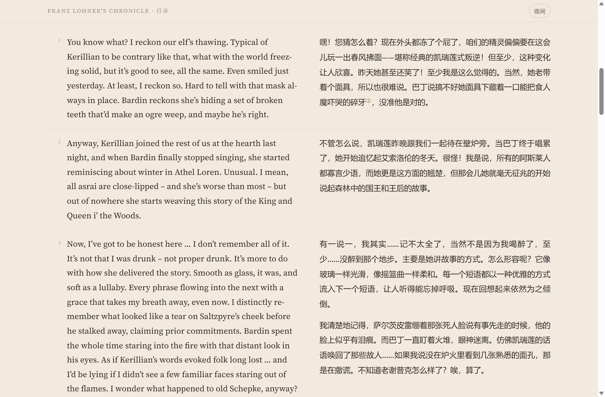

# Translation Workbench

English | [简体中文](README.zh.md)

Translation Workbench is an Agent Skill for running a structured translation project from source preparation through drafting, independent review, and user-led finalization.

Current version: `0.1.1`

It is designed for long-form or continuity-sensitive translation work that benefits from terminology, character or speaker context, background material, drafting notes, and a separate review pass. It is not limited to fiction, a particular language pair, or numbered chapters.

## Scope

The skill covers:

1. project initialization or adoption of existing material;
2. source acquisition and verification;
3. terminology and relevant-context preparation;
4. complete translation drafting and drafting notes;
5. independent review without editing the draft;
6. user-led decision making and finalization.

It does not include publishing, platform-specific conversion, dashboards, analytics, or subagent orchestration.

The two bundled checkers use only the Python 3 standard library. They validate context handoffs and stage boundaries; they do not judge literary quality.

## Supported runtimes

The canonical skill is stored once at `skills/translation-workbench/` and is intended for both Codex and Claude Code.

## Installation

Recommended installation from GitHub:

```bash
npx skills add Alexu0317-FATHER/translation-workbench
```

To target Codex and Claude Code explicitly:

```bash
npx skills add Alexu0317-FATHER/translation-workbench -a codex -a claude-code
```

The commands above install to the current project by default. Follow the installer's prompts if you prefer another supported scope or installation method.

Manual project-level installation remains available:

- Codex project skill location: `.agents/skills/translation-workbench/`
- Claude Code project skill location: `.claude/skills/translation-workbench/`

Install or copy the same complete skill directory into the location used by the runtime. Do not maintain separate copies of the translation rules by hand.

To update an installation managed by the skills CLI:

```bash
npx skills update translation-workbench
```

The skill prefers a runtime-native structured question tool when a decision has a short, finite option set. Claude Code can use `AskUserQuestion`; Codex can use `request_user_input` when that tool is available. The skill falls back to ordinary conversation when no structured tool is available or the answer is open-ended.

## Invocation

Examples:

```text
Use translation-workbench to set up a translation project from these files.
```

```text
$translation-workbench Start source preparation for the section named "The Crossing".
```

```text
/translation-workbench Continue the independent review of chapter 4.
```

The first form relies on the runtime recognizing the skill name and description. Codex commonly uses `$translation-workbench`; Claude Code commonly uses `/translation-workbench`.

## Recommended session pattern

Use a separate session for each major stage:

```text
source preparation -> translation -> independent review -> finalization
```

At the start of a session, name the project, translation unit, and stage. For example:

```text
Use translation-workbench. Read this project's README and perform the translation stage for chapter 4.
```

At the end of a stage, the skill reports the generated files and suggests a short prompt for the next session. This is a recommendation, not an enforced session policy. Results may vary across models and long-session strategies that have not been tested.

## Project initialization

The skill supports three starting situations:

- a new project with no existing structure;
- existing source or reference material that needs to be organized;
- an existing translation project that should keep its current structure.

For new projects, the skill creates a project `README.md` from its bundled template. That README becomes the project entry point and records the language pair, works or translation units, file roles, project references, and workflow links.

User-supplied Word documents, Markdown files, spreadsheets, PDFs, and other material remain unchanged. When the runtime can read them, the skill extracts relevant content into project documents using the bundled templates. It asks the user only when material conflicts, cannot be classified reliably, or requires an editorial choice.

Empty glossary, character, background, source, and style files are not created. They appear only when the user provides relevant material or the project produces its first durable entry.

## Example output



Each chapter is rendered as a side-by-side bilingual page: numbered paragraphs, footnotes that link to the translator's notes and back, a theme that follows the system, and a single-column fallback on narrow screens.

A complete project built with this workflow — a Simplified Chinese translation of *Franz Lohner's Chronicle* — lives in its own repository, [franz-lohners-chronicle-zh](https://github.com/Alexu0317-FATHER/franz-lohners-chronicle-zh), and reads at [https://alexu0317-father.github.io/franz-lohners-chronicle-zh/](https://alexu0317-father.github.io/franz-lohners-chronicle-zh/). Keeping it separate leaves this repository generic and small.

The screenshot shows fan-translated material owned by Fatshark, reproduced only to illustrate the output format.

## Canonical skill structure

```text
skills/translation-workbench/
├─ SKILL.md
├─ agents/
│  └─ openai.yaml
├─ references/
│  ├─ project-initialization.md
│  ├─ sourcing.md
│  ├─ translation.md
│  ├─ independent-review.md
│  └─ finalization.md
├─ scripts/
│  ├─ check_translation_context.py
│  ├─ check_stage.py
│  └─ test_*.py
└─ assets/
   └─ templates/
```

See [CHANGELOG.md](CHANGELOG.md) for release history. This project is released under the [MIT License](LICENSE).
