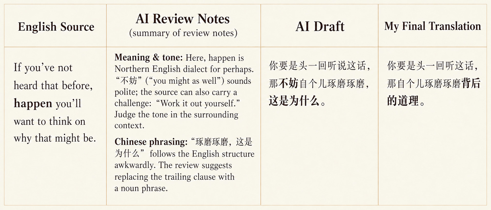
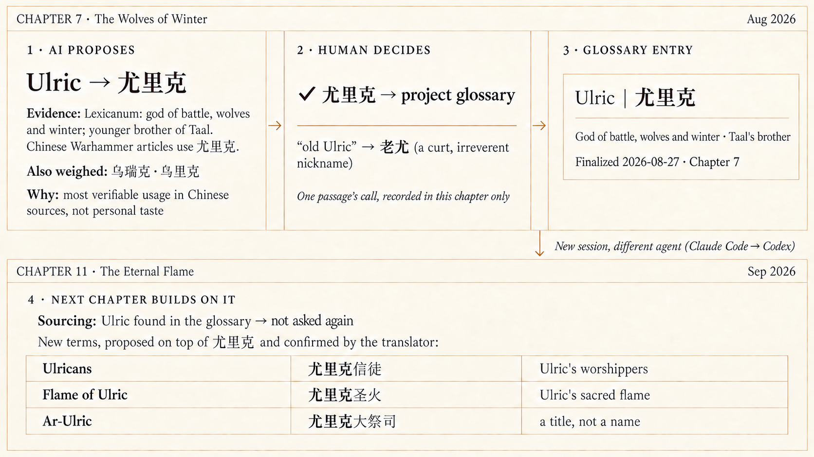

# Translation Workbench

English | [简体中文](README.zh.md)

[](https://skills.sh/Alexu0317-FATHER/translation-workbench)

**See past the source-language barrier. Write with your own voice.**

Translation Workbench is a set of Agent Skills for translation projects in Claude Code and Codex. The AI helps you understand the source, find supporting evidence, and draft a translation. What you learn from editing it can then guide later work.

Current version: `0.2.3`

**What's new in 0.2.3:** If you explain your edits by voice, the AI can condense your words by removing fillers, repetitions, and mis-transcriptions. Once you confirm the condensed version, it counts as your own words, keeping finalization records compact for later distillation. [See the changelog](CHANGELOG.md)

## Features

- **See the evidence behind the source, not just a finished draft.** The AI unpacks difficult sentences, checks dialect and idioms, and looks at surrounding context. That gives you something to judge the translation against.
- **Turn your reasons for edits into reusable translator style.** The separate distillation skill finds recurring patterns in your actual revisions and explanations, then updates style guidance and character profiles so later drafts have better references.
- **Carry project memory across chapters and sessions.** Terminology, character information, and confirmed choices stay in the project even when you move to another chapter or start a new conversation.
- **Get feedback that knows its place.** The source and confirmed terms are evidence; AI drafts and notes are working material. The AI can help you think through a choice without treating its earlier guesses as settled facts.

## Built through actual translation work

These skills grew out of my ongoing [Simplified Chinese translation of Franz Lohner's Chronicle](https://alexu0317-father.github.io/franz-lohners-chronicle-zh/). They are not a one-click translation button. Here is what they do:



In [The Fate of Grungni's Whisper](https://alexu0317-father.github.io/franz-lohners-chronicle-zh/franz-lohners-chronicle/chapters/08-the-fate-of-grungnis-whisper/output/index.html), the AI unpacked the dialect, phrasing, and evidence behind a line. I gave the final version its natural Chinese voice.



A term confirmed in Chapter 7, [The Wolves of Winter](https://alexu0317-father.github.io/franz-lohners-chronicle-zh/franz-lohners-chronicle/chapters/07-the-wolves-of-winter/output/index.html), carried through to related terms in Chapter 11, [The Eternal Flame](https://alexu0317-father.github.io/franz-lohners-chronicle-zh/franz-lohners-chronicle/chapters/10-the-eternal-flame/output/index.html), even after switching sessions and moving from Claude Code to Codex.

## How to use the skills

### Workflow at a glance

| Stage | What you do | What the AI does |
|---|---|---|
| Initialization | Provide material and say where you want to begin | Read or create the project entry point and preserve a workable directory layout |
| Source preparation | Supply the source and existing references | Check provenance and completeness, search terminology, and prepare unresolved terms and relevant context |
| Translation | Decide the translations of pending terms | Produce a draft and drafting notes, then save an initial-draft copy |
| Finalization | Discuss passages, choose the wording, and confirm the AI's understanding | Present source and translation, explain agreement or disagreement, obtain your confirmation of the analysis, record decisions, apply them together, and check the final saved text |
| Distillation (separate skill) | Decide which proposed insights belong in your translator style | Read work from earlier units and ask about the reasoning behind your edits to identify patterns worth keeping |

### Start with a message

Give the AI your source text, a file path, or a link. State the source and target languages and the chapter or section where you want to begin. If you have a glossary, character notes, or previous translations, point it to those too. You can still start without them; the AI inspects what exists and asks only for material it needs.

For a new project, you might say:

> Use translation-workbench. I want to translate [work title] from [source language] into [target language]. The source is at [file or link]. Please start with [chapter or section], inspect the material, and help me set up the project.

To continue an existing project, name its location, the translation unit, and the work you want done:

> Use translation-workbench. Read the README and existing files in [project folder] for [translation unit], then continue source preparation / translation / finalization.

You can use the same pattern in a new session. The AI picks up from the saved project files instead of relying on the previous conversation.

### Or invoke a skill directly

| Purpose | Codex | Claude Code (direct skill installation) |
|---|---|---|
| Prepare source material, translate, or finalize | `$translation-workbench` | `/translation-workbench` |
| Distill lessons from several completed units | `$translation-distillation` | `/translation-distillation` |

For example: `$translation-workbench Work through chapter 4 with me and finalize the translation.` Or: `$translation-distillation Distill style guidance from the completed chapters I specify.`

With the Claude plugin installation, the full commands are `/translation-workbench:translation-workbench` and `/translation-workbench:translation-distillation`.

In Codex, the distillation skill appears in the skill list as “沉淀 / Translation Distillation”.

### Two working records

**Drafting notes:** The AI creates these while translating to record why it made particular choices and where it ran into problems. You do not have to read them in advance; during finalization, the AI brings up the relevant notes passage by passage.

**Finalization record:** Created during finalization to preserve your wording, any reasons you provide, the AI's analysis, and your confirmation of that analysis. A passage stays pending until you confirm the AI's understanding.

## Getting more out of it

- **Use your own writing voice:** If a passage feels awkward, point out where it loses you and how you would say it. Understanding the source and writing well are different skills; the creative choices that give a translation its soul are yours.
- **Confirm the reasoning behind your edits:** When you revise the draft and the AI agrees, it explains what the draft got wrong and how your wording fixes it, for you to confirm or correct. You do not need to supply a separate explanation each time; any reasons you do provide are preserved in your own words, condensed for your confirmation when they run long.
- **Distill across several completed units:** A group of finalization records helps distinguish one-off wording from recurring problems. Terminology, facts, character voice, and general style go into their respective references, and existing entries can be revised or removed.
- **Use a separate session for each stage:** Keeping the stages in separate conversations gives the AI a clearer context and better performance.
- **Keep asking the AI:** If material is missing, terms are undecided, or a file might be overwritten, the skills explain what needs attention.

## Installation

Ask Claude Code or Codex to install both skills:

```text
Install both translation-workbench and translation-distillation from this repository for me, globally: https://github.com/Alexu0317-FATHER/translation-workbench
```

Globally means they are available across your projects. Replace it with “for this project only” to use them only in the current folder.

<details>
<summary>Claude Code plugin, skills.sh, and manual installation</summary>

### Claude Code plugin

```text
/plugin marketplace add Alexu0317-FATHER/translation-workbench
/plugin install translation-workbench@translation-workbench
```

### skills.sh (Codex and Claude Code)

Select both skills explicitly. The default scope is the current project:

```bash
npx skills add Alexu0317-FATHER/translation-workbench --skill translation-workbench --skill translation-distillation
```

Add `-g` for a global installation, or `-a codex -a claude-code` to select agents. To update these two skills:

```bash
npx skills update translation-workbench translation-distillation
```

Use `-p` for project updates or `-g` for global updates. More options are in the [skills CLI documentation](https://github.com/vercel-labs/skills#readme).

### Manual installation

Copy both `translation-workbench/` and `translation-distillation/` from this repository's `skills/` directory into `.agents/skills/` for Codex or `.claude/skills/` for Claude Code. Prefix the destination with `~/` for a user-level installation.

</details>

## After one translation unit

```text
your-translation-project/
├─ README.md                  # Project entry point
├─ <a translation unit>/
│  ├─ source.md               # Working copy of the source
│  ├─ sourcing-handoff.json   # Source-preparation handoff
│  ├─ <translated-title>.md   # Working translation, finalized here
│  ├─ initial-draft.md        # Preserved draft for later comparison
│  ├─ drafting-notes.md       # Drafting choices and passages to discuss
│  └─ review-notes.md         # Finalization decisions and reasons
├─ glossary.md                # Terminology
├─ character-profiles.md      # Character references
├─ translator-style.md        # Translator style
├─ background-notes.md        # Background reference
└─ sources.md                 # Source inventory
```

This is an example layout; existing projects keep their own paths. Files are created only when there is real content for them.

## Tested scope and license

Experience comes from an English-to-Chinese serialized-fiction project using Claude Code and Codex. The drafting comparison for this revision used Opus; the revised workflow has not been retested across other models, language pairs, and genres. Please share your own results in an [Issue](https://github.com/Alexu0317-FATHER/translation-workbench/issues). The checkers use only the Python standard library; CI runs on Python 3.11.

The [original translation project's bilingual website](https://alexu0317-father.github.io/franz-lohners-chronicle-zh/) is built with separate scripts. These skills provide translations, work records, and reusable project references. The code is released under the [MIT License](LICENSE); see [CHANGELOG.md](CHANGELOG.md) for release history.
