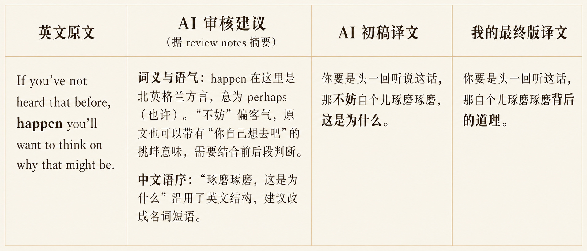
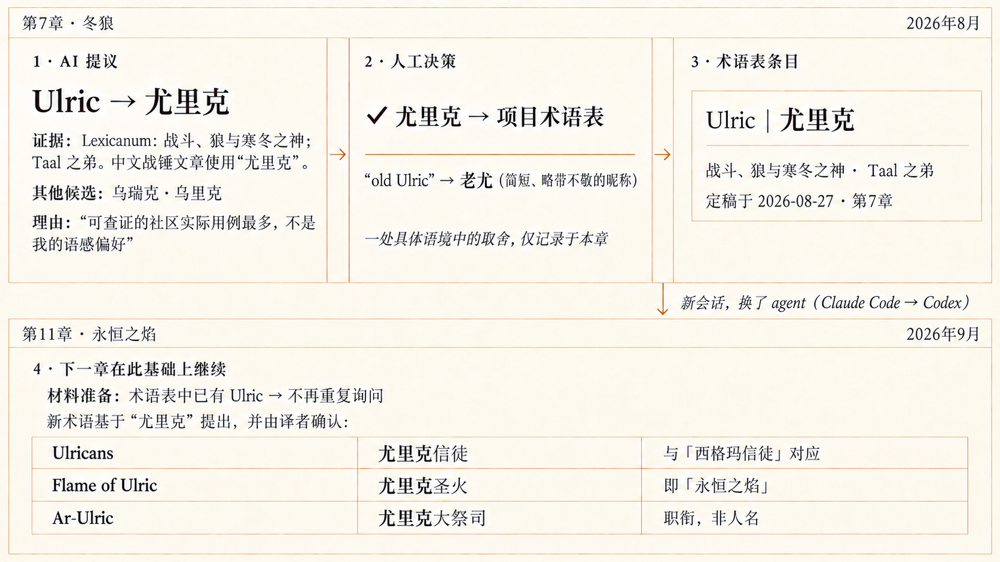

# Translation Workbench

[English](README.md) | 简体中文

[](https://skills.sh/Alexu0317-FATHER/translation-workbench)

**跨越原文理解的隐形门槛，释放你地道的文字表达力。**

Translation Workbench 是一套适合项目级翻译的 Agent Skills，Claude Code 和 Codex 都能用。AI 帮你读懂原文、查找依据、起草译文，再把你在实际修改中积累的经验用于后续翻译。

当前版本：`0.2.1`

**0.2.1 更新**：AI 赞同你的措辞后，先说明理由并请你确认理解，再将该段定稿。记录分别保留 AI 分析和你的确认原话。[查看版本记录](CHANGELOG.md)

## 功能特性

- **看清原文依据，而不只是拿到一版译文。** 拆解长难句、查证方言俚语与上下文语境。AI 提供客观的原文证据链，让你有底气去判断，而不是被动接受一版文字。
- **把你的改稿理由，炼成可复用的『译者风格』。** 独立的沉淀技能从你的实际修改和理由中归纳共同规律，更新风格指南与角色档案，让后续初稿越来越懂你的偏好。
- **跨章节、跨会话维持项目记忆。** 术语、人物资料和已确认的写法随项目保存，换章节、换会话，也能接着已有的判断往下做。
- **懂协作、不越界的反馈分寸。** 原文与术语是严肃依据，初稿与笔记仅供参考。让 AI 成为有分寸的翻译助手，而不是固执己见的辩手。

## 从实际翻译中走来

这套技能源于我持续更新的[《弗兰兹·洛纳编年史》中译项目](https://alexu0317-father.github.io/franz-lohners-chronicle-zh/)。技能并不提供“一键译文”的功能，提供的是如下帮助：



在[《低语号的下落》](https://alexu0317-father.github.io/franz-lohners-chronicle-zh/franz-lohners-chronicle/chapters/08-the-fate-of-grungnis-whisper/output/index.html) 的翻译中，AI 负责拆解俚语方言与句式依据，我在定稿环节赋予它地道的中文风味。



在第七章[《冬狼》](https://alexu0317-father.github.io/franz-lohners-chronicle-zh/franz-lohners-chronicle/chapters/07-the-wolves-of-winter/output/index.html)中确认的术语，到了第11章[《永恒之焰》](https://alexu0317-father.github.io/franz-lohners-chronicle-zh/franz-lohners-chronicle/chapters/10-the-eternal-flame/output/index.html)，即使换了会话、从 Claude Code 换到 Codex，相关新词仍沿用这个译名。

## 如何使用技能

### 流程表

| 阶段 | 你做什么 | AI 做什么 |
|---|---|---|
| 初始化 | 提供材料，说明想从哪里开始 | 读取或建立项目入口，沿用可用的目录结构 |
| 材料准备 | 提供原文和已有参考资料 | 核对来源与完整性，检索术语，整理待确认的新词和所需资料 |
| 翻译 | 决定待确认的新词译法 | 产出初稿和起草笔记，保存一份初稿副本 |
| 定稿 | 逐段讨论译文，决定措辞并确认 AI 的理解 | 展示原文和译文，说明赞同理由或具体分歧，请你确认分析后记录定稿，再统一应用修改并核对最终文件 |
| 沉淀（独立技能） | 决定AI的哪些提炼融入译者风格 | 读取过往的资料，并跟用户详细确认翻译时的想法，从而提炼出值得沉淀的翻译风格 |

### 从第一句话开始

你可以直接把原文、文件路径或链接交给 AI，说明源语言、目标语言，以及想从哪一章或哪一节开始。有术语表、人物资料或过去的译文，就一并告诉它；没有也可以先开始，AI 会检查现有材料，只追问真正缺少的信息。

新项目可以这样说：

> 使用 translation-workbench。我想把《作品名》从〔源语言〕译成〔目标语言〕，原文在〔文件或链接〕。请从〔章节或段落〕开始，先看看材料并帮我建立项目。

已有项目继续做时，告诉 AI 项目位置、翻译单元和这次要做的事：

> 使用 translation-workbench。请读取〔项目目录〕的 README 和〔翻译单元〕现有文件，继续材料准备／翻译／定稿。

之后每次换会话，沿用这句的说法即可；AI 会从项目文件接续工作，不要求你记住上一轮对话里的细节。

### 或者通过命令调用

| 用途 | Codex | Claude Code（直接安装技能） |
|---|---|---|
| 准备原文、翻译或逐段定稿 | `$translation-workbench` | `/translation-workbench` |
| 从已完成的多个单元中沉淀经验 | `$translation-distillation` | `/translation-distillation` |

例如：`$translation-workbench 与我逐段定稿第 4 章。` 或 `$translation-distillation 从我指定的几章中提炼译者风格。`

通过 Claude 插件安装时，完整入口分别是 `/translation-workbench:translation-workbench` 和 `/translation-workbench:translation-distillation`。

Codex 的沉淀技能在列表中显示为“沉淀 / Translation Distillation”。

### 两份工作记录

**起草笔记：** 在翻译阶段由 AI 生成，写下它为什么这么翻，以及翻译中遇到的问题。你不必事先通读；定稿时 AI 会按段带出相关内容。

**定稿记录：** 在定稿阶段产生，分别保存你的措辞、你主动说明的理由、AI 分析和你的确认原话。你确认 AI 的理解后，该段才标记为已定稿。

## 让技能更好用的秘诀

- **把你的地道表达用起来：** 读着别扭，就指出哪里卡住、你想怎么说。原文理解和写作是两种能力；AI不会创造，只有你才能构建译文的灵魂。
- **确认修改背后的理由：** AI 赞同你的措辞后，会先解释自己的理解，供你确认或纠正。你不必每次另作解释；你主动说明的理由会按原话保留。
- **积累多章后再沉淀：** 多份定稿记录能帮助区分偶然的措辞选择和反复出现的问题。术语、事实、人物声音和通用风格分别更新，已有条目也可以删改。
- **每个阶段一个会话：** 各阶段建立独立的会话，会让AI的表现更好。
- **尽管问AI：**材料缺失、术语未定或已有记录可能被覆盖时，技能会说明需要处理什么。

## 安装

把下面这句发给 Claude Code 或 Codex，让 AI 帮你装：

```text
帮我把这个仓库的 translation-workbench 和 translation-distillation 两个技能装到全局：https://github.com/Alexu0317-FATHER/translation-workbench
```

“全局”表示在各个项目中都能用；只想在眼前这个文件夹里用，就改成“只装到当前项目”。

<details>
<summary>Claude Code 插件、skills.sh 与手动安装</summary>

### Claude Code 插件

```text
/plugin marketplace add Alexu0317-FATHER/translation-workbench
/plugin install translation-workbench@translation-workbench
```

### skills.sh（Codex 和 Claude Code）

指定安装两个技能，默认装到当前项目：

```bash
npx skills add Alexu0317-FATHER/translation-workbench --skill translation-workbench --skill translation-distillation
```

加 `-g` 安装到全局；加 `-a codex -a claude-code` 指定使用的 agent。更新这两个技能：

```bash
npx skills update translation-workbench translation-distillation
```

更新时可用 `-p` 指定当前项目、`-g` 指定全局。更多选项见 [skills CLI 说明](https://github.com/vercel-labs/skills#readme)。

### 手动安装

将 `skills/` 中的 `translation-workbench/` 和 `translation-distillation/` 两个文件夹，复制到 Codex 的 `.agents/skills/` 或 Claude Code 的 `.claude/skills/`。安装到用户级就在目标路径前加 `~/`。

</details>

## 跑完一个单元后

```text
你的翻译项目/
├─ README.md                  # 项目入口
├─ <某个翻译单元>/
│  ├─ source.md               # 原文工作副本
│  ├─ sourcing-handoff.json   # 取材交接
│  ├─ <译文标题>.md            # 当前译文，最终在此定稿
│  ├─ initial-draft.md        # 保留的初稿，供后续对照
│  ├─ drafting-notes.md       # 起草取舍与待讨论位置
│  └─ 定稿记录.md             # 定稿决定与理由
├─ glossary.md                # 术语表
├─ character-profiles.md      # 人物档案
├─ translator-style.md        # 译者风格
├─ background-notes.md        # 背景资料
└─ sources.md                 # 来源清单
```

这是示例结构，已有项目沿用自己的路径。各文件在产生实际内容时才创建。

## 实测范围与许可

使用经验来自英译中连载小说项目中的 Claude Code 和 Codex。本次改版的翻译对照测试使用 Opus，新流程尚未在其他模型、语言对和文体上逐一复测。欢迎把实际使用情况写进 [Issue](https://github.com/Alexu0317-FATHER/translation-workbench/issues)。检查器只依赖 Python 标准库，CI 使用 Python 3.11。

[原翻译项目的双语网页](https://alexu0317-father.github.io/franz-lohners-chronicle-zh/)由另外的构建脚本生成。本技能提供译文、工作记录和可复用的参考资料。源码采用 [MIT License](LICENSE)，版本记录见 [CHANGELOG.md](CHANGELOG.md)。
